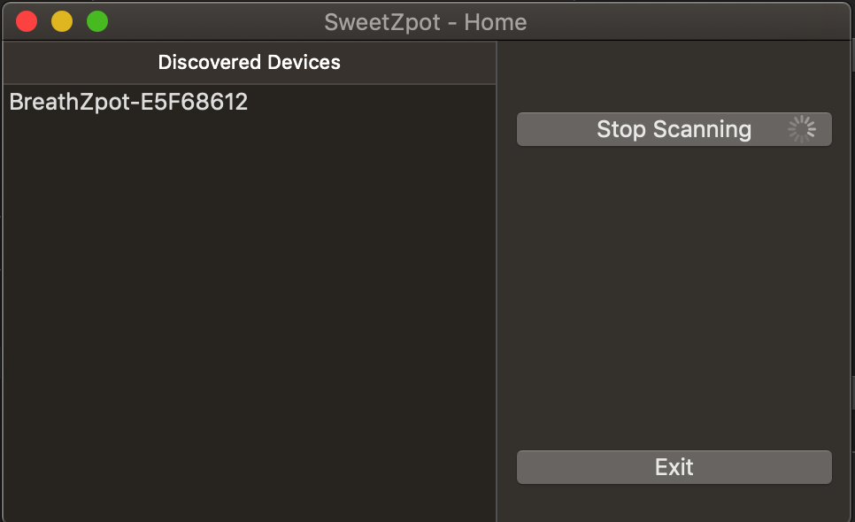
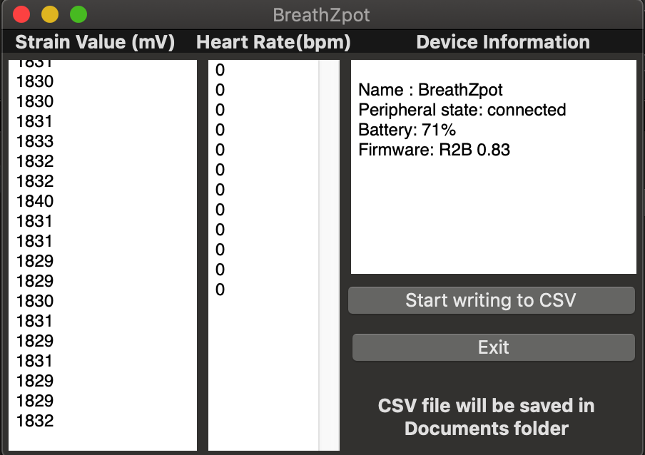
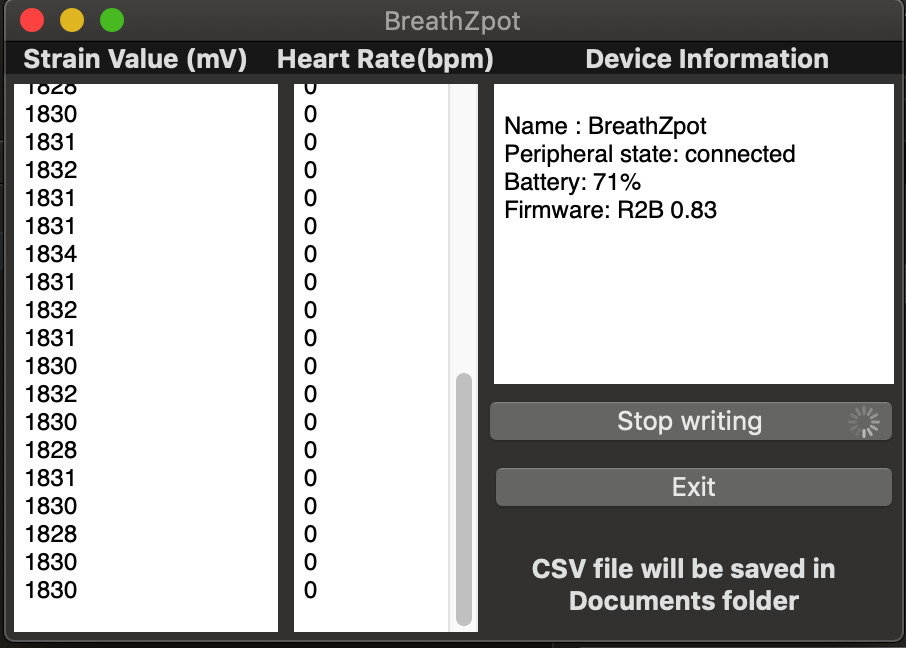

# SweetZpot-DataFlow
<h3><pre>A simple Mac app with the ability to connect to multiple SweetZopt BLE devices, 
reading Strain and HeartRate data and also to write the data to CSV file.</pre></h3>
<ul>
  <li> 
   
   
    <b>Home screen</b> - By default starts scanning for BLE devices and lists the available devices in range. 
  User can click on the listed devices to connect and retrieve data, 
  each selection will open in new window instance which lets eaily see and manage multiple connected devices.   
  

       
  </li>
  <li>
      
<b>Peripherial screen</b> - Lets User see the live reading of data from the device and
      also displays relevant information such as connection status, battery percentage and firmware version 
      of the connected device.

      
  </li>
  <li>
      
<b>Write to CSV file</b> - In the peripherial screen "start writing to CSV" button 
      if pressed starts writing live sensor data to a file named as <b>"UUID_Time"</b> which will be stored in <b>Documents</b>
      directory in Mac Finder.

      
  </li>
</ul>

<h3>References</h3>
<ul>
<li>
    <a href="https://en.wikipedia.org/wiki/Bluetooth_Low_Energy">Bluetooth Low Energy - Wikipedia</a>
</li>
<li>
   <a href="https://www.bluetooth.com/specifications/gatt/generic-attributes-overview/">The Generic Attributes (GATT)</a>
</li>
<li>
    <a href="https://developer.apple.com/documentation/corebluetooth">Core Bluetooth</a>
</li>
</ul>
